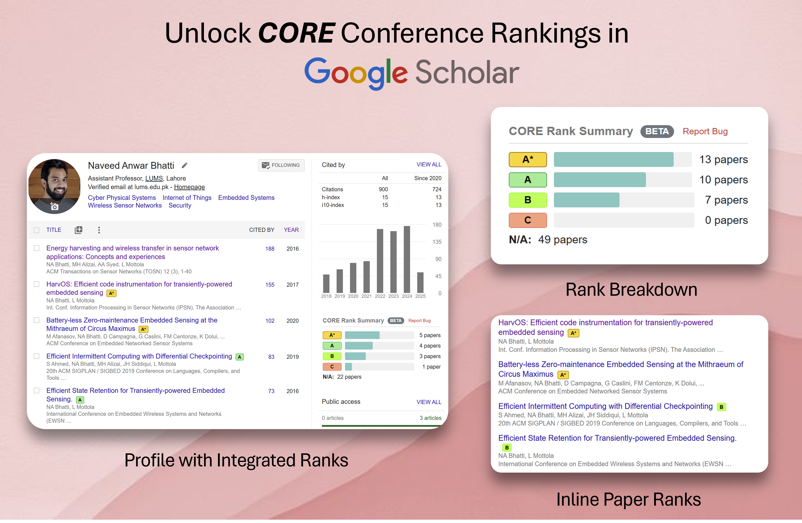

# Google Scholar Conference Ranker (CORE Edition)

[](https://opensource.org/licenses/MIT)

**Instantly see CORE conference rankings directly on Google Scholar profile pages! Essential for researchers in Computer Science, Electrical Engineering, and related fields.**

This Chrome extension enhances your Google Scholar experience by automatically fetching and displaying [CORE Conference Rankings](http://portal.core.edu.au/conf-ranks/) (currently using CORE 2023 data) for publications. It helps you quickly assess the prestige of conference venues without leaving the Scholar page.




## Why This Extension?

In fields like Computer Science (CS) and Electrical Engineering (EE), top-tier conferences are pivotal for disseminating cutting-edge research, often holding prestige comparable to or exceeding that of journals. However, unlike the readily available Impact Factor for journals, quickly discerning a conference's ranking can be challenging.

This extension solves this by:
*   Displaying a **summary panel** on Google Scholar profiles, showing the count of papers per CORE rank (A\*, A, B, C, N/A).
*   Tagging **individual publications** in the list with their respective CORE rank badge.
*   Helping you **save time** and **quickly evaluate** the quality of conference venues and research output.

## Key Features

*   **Automatic Ranking:** Fetches venue details and matches them against CORE 2023 data.
*   **Inline Rank Display:** Shows a colored rank badge (A\*, A, B, C) next to each ranked paper title.
*   **Profile Summary Panel:** Injects a summary block on the right sidebar of Google Scholar profiles, showing paper counts for each rank.
    *   Includes a "BETA" label with a helpful tooltip for users.
    *   Provides a "Report Bug" link for easy feedback.


## Installation (Developer Mode for Chrome)

1.  **Download or Clone:**
    *   **Option A (Download ZIP):** Go to the [Google Scholar Conference Ranker GitHub repository](https://github.com/naveedanwarbhatti/Google-Scholar-Conference-Ranker/). Click on the green "Code" button, then "Download ZIP". Extract the ZIP file to a folder on your computer.
	
    *   **Option B (Clone with Git):** If you have Git installed, clone the repository:
        ```bash
        git clone https://github.com/naveedanwarbhatti/Google-Scholar-Conference-Ranker.git
        ```
        The `dist/content.js` file (the compiled JavaScript) is included in the repository.

2.  **Load the Extension in Chrome:**
    *   Open Google Chrome.
    *   Navigate to `chrome://extensions` (or by clicking Menu -> Extensions -> Manage Extensions).
    *   Enable **"Developer mode"** using the toggle switch, usually found in the top-right corner.
    *   Click the **"Load unpacked"** button that appears (usually on the top-left).
    *   Select the **root directory** of the extension (the folder where `manifest.json` is located, e.g., the `Google-Scholar-Conference-Ranker` folder you downloaded/cloned).

3.  **Verify:**
    *   The "Google Scholar Conference Ranker" should now appear in your list of extensions and be enabled.
    *   Navigate to a Google Scholar profile page (e.g., `https://scholar.google.com/citations?user=...`). The extension should automatically run. You should see the progress bar, then the summary panel, and ranks next to papers.


## Data Source

This extension currently uses the [**CORE 2023 Conference Rankings**](http://portal.core.edu.au/conf-ranks/).

## Contributing & Bug Reports (BETA)

This extension is currently in BETA. Your feedback is invaluable!

*   **Report a Bug:** Please use the ["Report Bug"](https://forms.office.com/r/PbSzWaQmpJ) link in the summary panel or open an issue on the [GitHub Issues page](https://github.com/naveedanwarbhatti/Google-Scholar-Conference-Ranker//issues). When reporting, please include:
    *   The Google Scholar profile URL.
    *   The specific paper/venue that was mismatched or not detected.
    *   The expected rank/behavior.
    *   Any console errors if applicable.
*   **Feature Requests:** Feel free to open an issue for feature suggestions.
*   **Pull Requests:** Contributions are welcome! Please open an issue first to discuss significant changes.

## Future Ideas
*   Support for other ranking systems (e.g., Qualis, CCF).
*   User-configurable settings (e.g., preferred ranking system, option to hide N/A).
*   More advanced venue name disambiguation.

## License

This project is licensed under the MIT License - see the [LICENSE](LICENSE) file for details (You'll need to create a LICENSE file with the MIT license text).
